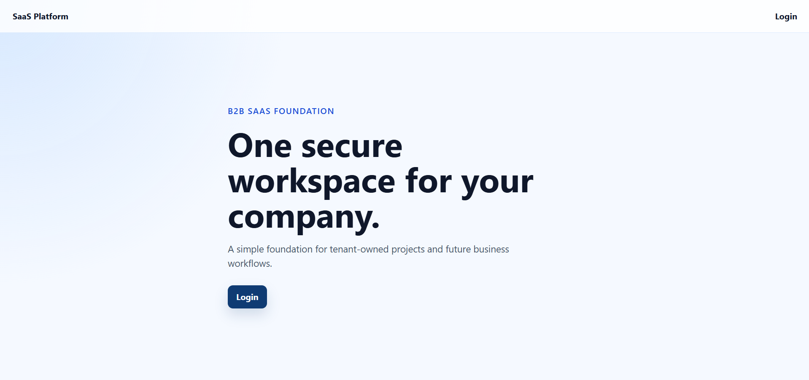
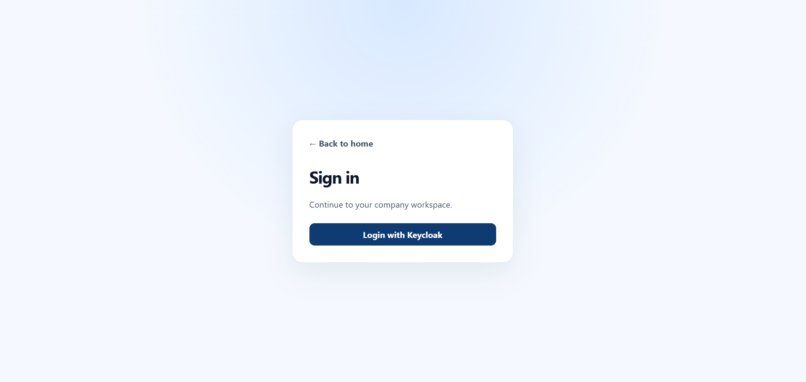
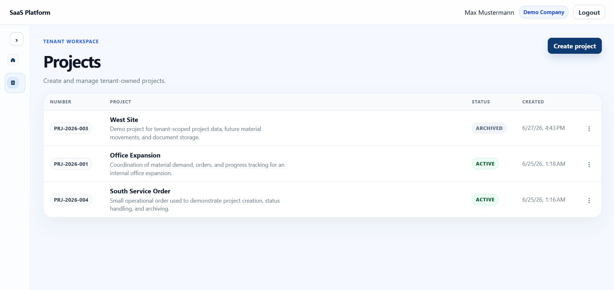
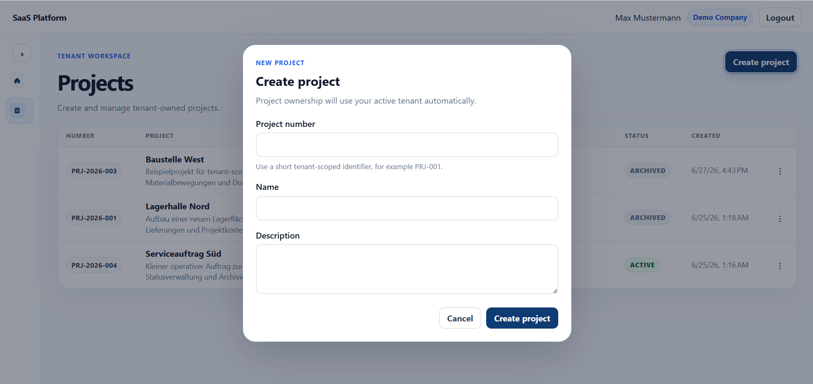

# SaaS Platform Prototype

Dieses Projekt ist ein B2B-SaaS-Prototyp für mandantenfähige Geschäftsprozesse. Der Fokus liegt aktuell auf Authentifizierung, sauberer Backend-Struktur, Tenant-Isolation und einer modernen Angular-Oberfläche.

Es ist ein persönliches Showcase-Projekt und bewusst als kompakter modularer Monolith gehalten. Der nächste fachliche Ausbau soll in Richtung Materials / Inventory Master Data gehen.

## Warum dieses Projekt?

- eigenes Lern- und Showcase-Projekt
- B2B-SaaS-Grundlage mit Mandantenfähigkeit
- Fokus auf Spring Boot Backend, BFF-Auth, PostgreSQL/Flyway und Angular
- technische Regeln wie Tenant-Isolation, CSRF, PKCE und serverseitige Sessions sind bewusst Teil des Designs

## Tech Stack

- Backend: Java 21, Spring Boot, Spring Security OAuth2 Client
- Frontend: Angular
- Datenbank: PostgreSQL
- Migrationen: Flyway
- Auth: Keycloak / OpenID Connect
- Tests: JUnit, Testcontainers, Vitest
- Dev-Setup: Docker Compose für lokale Infrastruktur

## Architektur kurz erklärt

- Spring Boot arbeitet als Backend-for-Frontend.
- Login läuft über Keycloak und OpenID Connect.
- Tokens bleiben serverseitig in der Spring-Session.
- Angular speichert keine JWTs und dekodiert keine Tokens.
- CSRF ist aktiv; PKCE S256 ist aktiv.
- Mandantenfähigkeit basiert auf `Tenant`, `AppUser` und `TenantMembership`.
- Fachliche Daten werden serverseitig tenant-scoped geladen.
- Das Frontend sendet für tenant-owned Daten keine `tenantId`.

## Entwicklungsprinzipien

- fachliche Logik liegt im Backend, nicht im Frontend
- Tenant-Isolation wird serverseitig erzwungen
- Datenbankschema wird über Flyway versioniert
- Sicherheitsentscheidungen werden bewusst explizit gehalten
- Kommentare werden sparsam genutzt und erklären vor allem Architektur- oder Sicherheitsentscheidungen

## Aktueller Funktionsumfang

- Login über Keycloak
- session-basierte Angular-Anbindung über Cookies
- Benutzer- und Tenant-Kontext
- Projekte anlegen, anzeigen und archivieren
- Tenant-Isolation im Backend
- Flyway-Datenbankschema
- Backend-Tests inklusive PostgreSQL-Testcontainers
- erste moderne Angular-Oberfläche mit Projekttabelle, Dialogen und Sidebar

## Screenshots

### Landing Page


### Login


### Projekte


### Projekt anlegen


## Provisioning / Demo-Daten

Das öffentliche Showcase-Repository enthält bewusst keinen automatischen Dev-Seeder und keine festen Demo-Identitäten.
Für eine lokale Demo muss ein Keycloak-Benutzer aktuell manuell mit einem `AppUser`, einem `Tenant` und einer `TenantMembership` in der App-Datenbank verknüpft werden.

Ein produktionsnaher Onboarding-Flow, zum Beispiel über JIT-Provisioning oder Einladungen pro Tenant, ist ein geplanter späterer Schritt.
## Lokal starten

Voraussetzungen:

- Java 21
- Node.js / npm
- Docker Desktop
- lokaler Keycloak-Realm mit passendem OAuth2-Client

PostgreSQL starten:

```powershell
cd backend
docker compose up -d
```

Backend im Dev-Profil starten:

```powershell
cd backend
$env:SPRING_PROFILES_ACTIVE="dev"
$env:KEYCLOAK_CLIENT_SECRET="<placeholder>"
.\mvnw.cmd spring-boot:run
```

Frontend starten:

```powershell
cd frontend
npm start
```

Das Frontend läuft lokal über den Angular Dev Server. API-, Logout- und OAuth2-Aufrufe werden über den Proxy an das Spring Boot Backend weitergeleitet.

## Qualität und Tests

Im Backend sind die wichtigsten Grundlagen getestet: Tenant-Auflösung, Projektlogik, PKCE-Konfiguration und Tenant-Isolation mit PostgreSQL/Testcontainers. Flyway-Migrationen werden dabei ebenfalls gegen eine echte Testdatenbank validiert.

Im Frontend gibt es erste Vitest-Tests für die Angular-Struktur und Auth-Guards. Die Frontend-Testabdeckung ist bewusst noch klein und wird mit den nächsten Modulen erweitert.
Backend:

```powershell
cd backend
.\mvnw.cmd verify
```

Frontend:

```powershell
cd frontend
npm run build
npm test -- --watch=false
```

Falls PowerShell `npm.ps1` blockiert:

```powershell
npm.cmd run build
npm.cmd test -- --watch=false
```

## Deployment / DigitalOcean

Die aktuelle Showcase-Deployment-Struktur nutzt Keycloak als separate DigitalOcean App Platform Container-App. Backend und Angular-Frontend laufen zusammen unter einer App-Platform-App und Domain.

Deployment-Details, notwendige Umgebungsvariablen, Frontend-Build-Pfade und die erforderlichen `preserve_path_prefix: true` Routen sind hier dokumentiert:

[DigitalOcean deployment notes](docs/deployment-digitalocean.md)

Ein produktionsnahes Deployment erfordert aktuell weiterhin manuelles Keycloak-Realm-/Client-Setup sowie manuelles Provisioning der Demo-Benutzer, Tenants und TenantMemberships. Das Projekt erhebt bewusst keinen Anspruch auf vollautomatisches Production-Onboarding.

## Status

Das Projekt ist ein Prototyp und Work in Progress. Der aktuelle Stand deckt Authentifizierung, Tenant-Kontext, Projekte und grundlegende UI-Flows ab.

Geplanter nächster Schritt: Materials / Inventory Master Data.

## Hinweis

Dieses Repository enthält keine Produktivdaten und ist ein persönliches Showcase-Projekt. Lokale Secrets wie Keycloak-Client-Secrets gehören nicht ins Repository.
